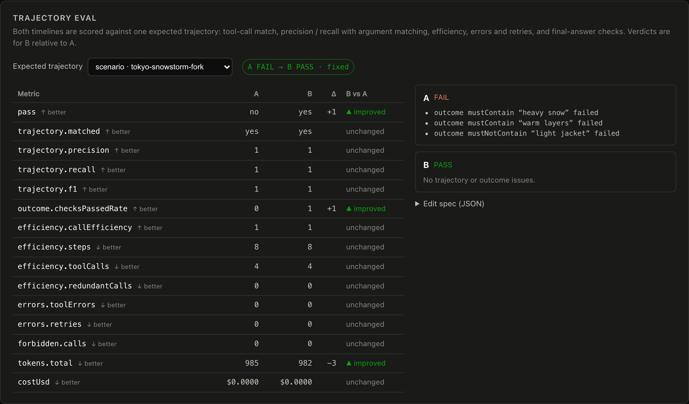
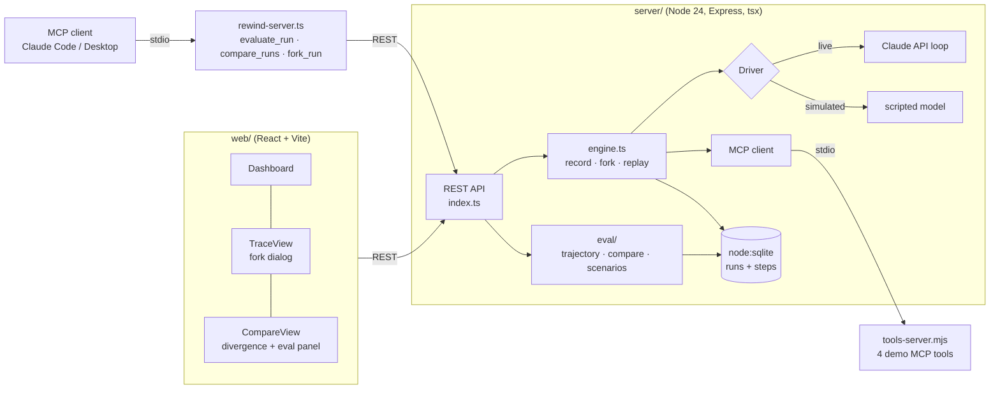

# ⟲ Rewind — time-machine debugging and trajectory eval for AI agents

**Record an agent run, fork any step, change reality, re-run only the future — then score both
timelines against an expected tool-call trajectory and see exactly which metrics the fork
improved or broke.**

[](https://github.com/ashiksharonm/rewind/actions/workflows/ci.yml)

Live demo: https://rewind-e4mo.onrender.com (simulated mode, free tier — **the first request
after idle takes ~30 s** while the instance wakes; see [Deploy](#deploy-your-own-free)).
Feedback & bugs → [GitHub Issues](https://github.com/ashiksharonm/rewind/issues).

Most agent observability is read-only: you can look at a trace, but you can't touch it. Rewind
makes traces **executable** (*git branch, for agent runs*) and **gradeable**: every run is
recorded step by step (model turns + MCP tool calls); any step can be forked; and any run or
pair of timelines can be scored with a trajectory evaluator — from the UI, the REST API, an MCP
tool (`evaluate_run`), or offline on an exported trace.



*The compare view's eval panel, captured with headless Chromium against a local server: the
parent run fails the `tokyo-snowstorm-fork` spec (its answer says "light jacket"), the fork
with the edited weather result passes — same trajectory, outcome fixed.*

## What's in it

| Pillar | Where |
|---|---|
| **Fork & replay** | `server/src/engine.ts` — a recorded step prefix is losslessly an Anthropic message history (`buildMessages`); forking = copy prefix → apply one edit → resume the loop. Parents are never mutated. |
| **Trajectory eval** | `server/src/eval/` — exact / in-order / any-order tool-call matching, precision/recall/F1 with argument matching, efficiency, errors/retries, outcome checks, and a timeline diff. |
| **MCP, both directions** | The agent's tools are a real MCP stdio server (`mcp/tools-server.mjs`, `@modelcontextprotocol/sdk`). Rewind itself is also an MCP server (`mcp/rewind-server.ts`) exposing `list_runs`, `get_run`, `fork_run`, `evaluate_run`, `compare_runs`. |
| **AI agent** | A hand-rolled tool-use loop over the Claude API (`claude-opus-4-8`, adaptive thinking) — hand-rolled deliberately, because recording/replay must own every step boundary. A deterministic simulated model runs the same loop with no API key. |
| **Observability UI** | Per-step tokens/cost/latency, a dashboard, aligned timeline compare with divergence detection, and the eval panel. Palette contrast is measured, not asserted ([docs/palette-report.md](docs/palette-report.md)). |

## The time-machine operations

1. **Edit a tool result** — "what if the weather API had said *heavy snow*?" The prefix is
   replayed from the recording with your edit; the future re-executes for real.
2. **Reroll a model turn** — drops the turn and everything after it, then re-samples.
3. **Edit the prompt** — replays the whole run against a new user/system prompt.

Forks keep lineage (`parentRunId`, `forkAtIndex`). For a tool-result edit the whole parallel
tool group is kept so the rebuilt history has a complete `tool_result` message.

## Trajectory evaluation

A **spec** describes what a good run looks like:

```jsonc
{
  "expected": [
    { "tool": "get_weather",      "args": { "city": "Tokyo" } },
    { "tool": "convert_currency", "args": { "from": "USD", "to": "JPY" } },
    { "tool": "search_flights",   "args": { "origin": "San Francisco", "destination": "Tokyo" } }
  ],
  "match": "in_order",          // exact | in_order | any_order
  "argMatch": "subset",         // exact | subset | ignore (per-call override allowed)
  "maxToolCalls": 4, "maxSteps": 8, "forbiddenTools": [],
  "outcome": { "mustContain": ["warm layers"], "mustNotContain": ["light jacket"] }
}
```

What gets scored (`server/src/eval/trajectory.ts`, all pure functions over recorded steps):

- **Trajectory match** — `exact` (same calls, same order, nothing extra), `in_order` (expected
  calls appear as a subsequence; extras allowed) or `any_order`. Calls issued together in one
  parallel group are treated as unordered relative to each other — the model emitted them
  simultaneously, so their listing order is not a decision.
- **Tool-call precision / recall / F1** with argument matching. Pairing uses maximum bipartite
  matching (Kuhn's augmenting paths), so one loose expectation can't steal the only call that
  satisfies a stricter one. Strings compare trimmed and case-insensitively.
- **Efficiency** — steps, LLM calls, tool calls, redundant calls (repeats of an earlier
  successful identical call), expected/actual call ratio, step and tool-call budgets.
- **Errors** — tool errors, retries (calls to a tool whose previous call errored), run error.
- **Outcome** — substring / negative-substring checks (and regex, library/CLI only) on the
  final answer.
- **Timeline diff** (`compare.ts`) — every metric for A and B, its delta, and an
  improved / regressed / unchanged verdict that respects direction (↑ or ↓ is better), plus a
  pass flip (`fixed`, `broke`, `still-passing`, `still-failing`).

Without a spec, Rewind uses run A's own tool calls as the expected trajectory — a quick way to
see how far a fork drifted from its parent.

### Scenario results

`npm run eval` records 7 scenarios on the simulated agent through the real MCP tools server
(3 are forks: edited tool result, reroll, prompt edit), scores them, and writes
[`eval/results/scenarios.json`](eval/results/scenarios.json) and
[`eval/results/summary.md`](eval/results/summary.md). The output is deterministic; CI re-runs
it and fails if the committed results drift.

| Scenario | Mode | Verdict | Expected | Precision | Recall | Outcome checks |
|---|---|---|---|---|---|---|
| `tokyo-baseline` | in_order | PASS | PASS | 100% | 100% | 3/3 |
| `paris-exact` | exact | PASS | PASS | 100% | 100% | 2/2 |
| `tokyo-snowstorm-fork` | in_order | PASS | PASS | 100% | 100% | 3/3 |
| `sydney-reroll-consistency` | exact | PASS | PASS | 100% | 100% | 2/2 |
| `mumbai-prompt-fork` | any_order | PASS | PASS | 100% | 100% | 3/3 |
| `rome-minimal-exact` (negative control) | exact | FAIL | FAIL | 50% | 100% | — |
| `lisbon-unknown-city` (real agent bug) | in_order | FAIL | FAIL | 0% | 0% | 0/1 |

Evaluator verdicts matching expectation: **7/7**. Fork vs parent under the same spec: the
snowstorm fork and the Mumbai prompt fork flip FAIL → PASS; the reroll stays PASS with no
metric changes. `lisbon-unknown-city` catches a genuine bug in the scripted agent: Lisbon is
not in its city table, so it silently plans a trip to Tokyo instead.

> These numbers describe the **evaluator** on a scripted, deterministic agent with known
> behaviour. They are not a benchmark of any LLM.

### Using it

```bash
npm run eval                                        # scenario suite → eval/results/
npm run eval:trace -- eval/fixtures/tokyo-baseline.simulated.trace.json my-spec.json
curl -X POST localhost:4600/api/runs/<id>/evaluate -H 'Content-Type: application/json' -d '{"spec": {...}}'
curl -X POST localhost:4600/api/compare -H 'Content-Type: application/json' -d '{"a":"<parent>","b":"<fork>"}'
```

As an MCP server (Claude Code / Claude Desktop / any MCP client), pointing at a running instance:

```jsonc
{
  "mcpServers": {
    "rewind": {
      "command": "npx",
      "args": ["tsx", "/path/to/rewind/server/src/mcp/rewind-server.ts"],
      "env": { "REWIND_URL": "http://localhost:4600" }
    }
  }
}
```

## Quick start

Requires **Node 24+** (uses the built-in `node:sqlite`).

```bash
npm ci
npm run build     # build the web UI
npm run seed      # demo traces (simulated model — free, deterministic)
npm start         # http://localhost:4600
```

Runs use the **simulated model** unless credentials are present (MCP tools are real either way).
To run against Claude:

```bash
export ANTHROPIC_API_KEY=sk-ant-...   # or REWIND_MODE=live with an `ant auth login` profile
npm start
```

| Env var | Default | Meaning |
|---|---|---|
| `REWIND_MODE` | auto | `live` / `simulated` (auto-detects credentials) |
| `REWIND_MODEL` | `claude-opus-4-8` | Model for live runs |
| `PORT` | `4600` | HTTP port |
| `REWIND_DATA_DIR` | `server/data` | SQLite location |
| `REWIND_AUTOSEED` | `1` | Seed demo traces on boot when the store is empty |
| `REWIND_URL` | `http://localhost:4600` | (MCP server only) Rewind instance to talk to |

## Architecture



## Screenshots

**Dashboard** — stat tiles, tokens-per-run chart (⑂ marks forks), run launcher, trace library.


**Trace timeline** — every model turn and MCP tool call is a step with tokens, cost and latency,
each with its fork control. The amber *edited in fork* badge marks where reality was rewritten.


**Compare view (timelines)** — shared prefix aligned row by row, a rule at the divergence
point, Δ tokens / Δ cost in the header. (Captured before the eval panel was added above the
timelines.)


## Testing

| Suite | Command | What it covers |
|---|---|---|
| Unit (34 tests, vitest) | `npm test` | `buildMessages`, recording, every fork edit type (parent never mutated, parallel groups, reroll truncation, prompt edit, validation), all scoring functions, timeline diff, a recorded trace fixture |
| HTTP smoke (33 checks) | `npm start` then `npm run smoke` | trace shape, fork semantics end to end, evaluate/compare endpoints, validation, delete, rate limit |
| MCP smoke (4 checks) | `npm start` then `npm run smoke:mcp` | spawns `rewind-server.ts` with the official SDK client; `evaluate_run`, `fork_run`, `compare_runs`, error surfacing |
| Eval reproducibility | `npm run eval && git diff --exit-code eval/results` | scenario verdicts and metrics are byte-identical run to run |
| Palette | `npm run check:palette` | regenerates `docs/palette-report.*` (CI fails on drift) |

CI (`.github/workflows/ci.yml`) runs all of the above plus a typecheck of server and web on
every push and PR, against a server booted in simulated mode.

## Accessibility

[`docs/palette-report.md`](docs/palette-report.md) is generated from the stylesheet tokens:
22/22 token-on-surface pairs meet WCAG 2.x (text and status colors 4.5:1, chart marks 3:1).
Under simulated protanopia / deuteranopia / tritanopia (Machado 2009) the two chart series
stay ≥ 21.5 ΔE apart and the improved/regressed verdict colors ≥ 15.1 ΔE; neither relies on
color alone. This is a computed check, not a user study, and the UI is dark-only.

## Deploy your own (free)

Run the `Dockerfile` on any container host; a Render blueprint is in `render.yaml`. A public
instance boots in simulated mode — the agent is scripted and costs nothing, while MCP tooling,
recording, forking, comparison and evaluation are all real. Add `ANTHROPIC_API_KEY` for live
Claude runs. Write endpoints are rate-limited (30/min/IP).

- **Cold start:** Render's free plan sleeps idle services. Measured on 2026-10-05: first
  `/api/health` request after idle **32.7 s**, the next one **0.86 s**
  ([raw output](docs/render-cold-start.txt)). If you need it warm for a demo, open
  `/api/health` a minute beforehand; no keep-alive pinger is bundled.
- **Persistence:** on ephemeral-disk hosts traces reset on redeploy. Mount a volume at `/data`.

## API

- `GET  /api/health` — mode, model, MCP tools
- `GET  /api/runs` · `POST /api/runs {prompt, system?, name?}`
- `GET  /api/runs/:id` — run + full step trace (this JSON is also the offline trace format)
- `POST /api/runs/:id/fork {atIndex, edit}` — edit ∈ `{type:'tool_result',newResult}` | `{type:'reroll'}` | `{type:'prompt',newUserMessage?,newSystem?}`
- `POST /api/runs/:id/evaluate {spec? | referenceRunId?}` — eval report
- `POST /api/compare {a, b, spec?}` — both reports + per-metric diff (B vs A)
- `GET  /api/eval/scenarios` — shipped scenario specs
- `DELETE /api/runs/:id`

## Dev mode

```bash
npm run dev:server   # API on :4600
npm run dev:web      # Vite on :5173 (proxies /api)
```

## Limitations

- **No live-model results are committed.** Every number above comes from the deterministic
  simulated agent; the committed trace fixture is a simulated run through the real MCP tools.
  Live mode works but needs an `ANTHROPIC_API_KEY`, and live traces are not reproducible.
- The demo toolset is four deterministic MCP tools for travel planning, not real APIs.
- Simulated token counts are estimated (characters / 4) and simulated cost is $0.
- Outcome checks are string-based. There is no LLM-as-judge scoring of the final answer.
- Regex outcome checks are disabled over HTTP (ReDoS risk on a shared instance); use the CLI.
- Single-process server with an in-memory rate limiter and SQLite. It is meant for local use
  and demos, not multi-tenant production.
