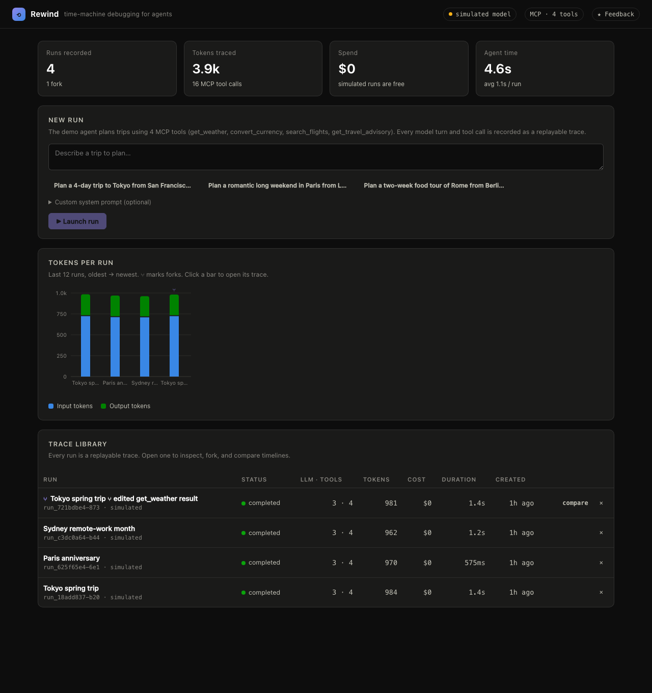
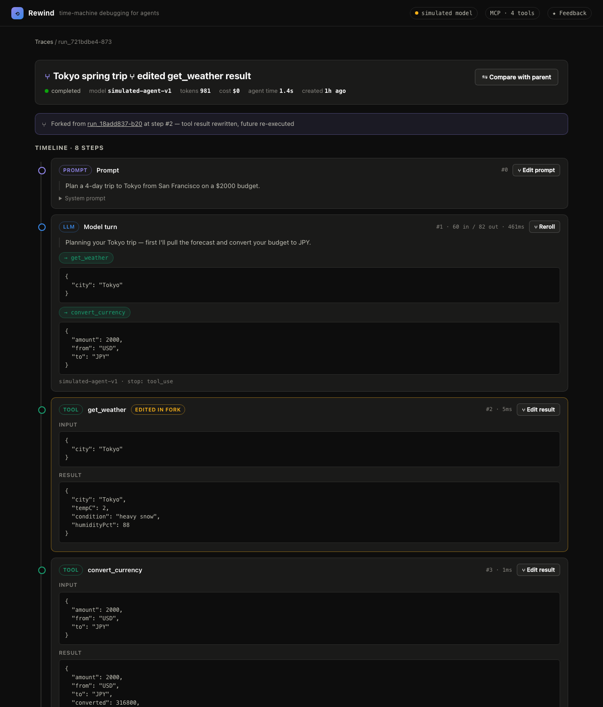
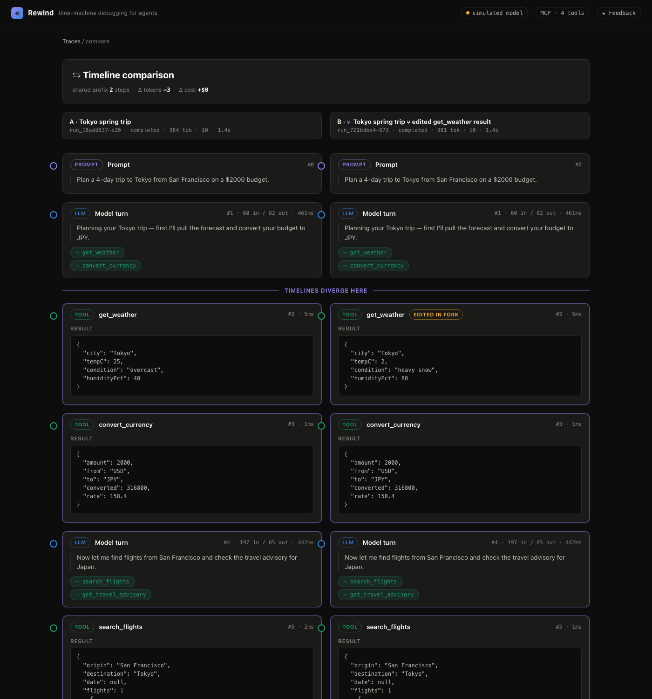

# ⟲ Rewind — time-machine debugging for AI agents

Live URL: https://rewind-e4mo.onrender.com

**Feedback & bugs → [GitHub Issues](https://github.com/ashiksharonm/rewind/issues)**

Today's agent observability is **read-only**: you can look at a trace, but you can't touch it.
Rewind makes traces **executable**. Every agent run is recorded step-by-step (model turns + MCP
tool calls), and any recorded step can be **forked**: rewind to it, edit reality, and re-execute
only the future — then compare the two timelines side by side.

> *git branch, for agent runs.*

## What it demonstrates

| Pillar | Where |
|---|---|
| **MCP** | The agent's tools are served by a real MCP server (`@modelcontextprotocol/sdk`, stdio transport) with 4 deterministic demo tools. Tool calls flow through a real MCP client in both live and simulated modes. |
| **AI agents** | A manual tool-use loop over the Claude API (`claude-opus-4-8`, adaptive thinking) — the loop is hand-rolled *deliberately*, because recording/replay must own every step boundary. |
| **Observability** | The recording layer *is* the product: per-step tokens, cost, and latency; run-level metrics; a dashboard with a validated accessible chart palette; and fork-vs-parent diffing. |

## The three time-machine operations

1. **Edit a tool result** — "what if the weather API had said *heavy snow*?" The prefix is
   replayed from the recording with your edit; the future re-executes for real.
2. **Reroll a model turn** — "would the agent do this again?" Drops the turn and everything
   after it, then re-samples.
3. **Edit the prompt** — replays the entire run against a new user/system prompt as a new
   timeline, keeping the original for comparison.

Forks never mutate the parent. The compare view aligns both timelines, finds the exact
divergence point, and shows Δ tokens / Δ cost.

## Screenshots

**① Dashboard — mission control.** Stat tiles (runs, tokens, spend, agent time), a
tokens-per-run chart (⑂ marks forks), the run launcher, and the trace library.



**② Trace timeline — the flight recorder.** Every model turn and MCP tool call is a step
with tokens, cost, and latency. Each step carries its time-machine control: **⑂ Edit prompt**,
**⑂ Reroll**, or **⑂ Edit result**. The amber *edited in fork* badge marks where reality was
rewritten — here, Tokyo's weather changed to a snowstorm.



**③ Compare view — two timelines, one divergence point.** The shared prefix is aligned
row-by-row, a rule marks exactly where the timelines split (original 25 °C vs edited 2 °C
heavy snow), and the header shows Δ tokens / Δ cost between parent and fork.



## Quick start

```bash
npm install
npm run build     # build the web UI
npm run seed      # create demo traces (simulated model — free, deterministic)
npm start         # http://localhost:4600
```

Runs use the **simulated model** by default (deterministic scripted agent; MCP tools are still
real). To run against Claude:

```bash
export ANTHROPIC_API_KEY=sk-ant-...   # or `ant auth login` + REWIND_MODE=live
npm start
```

| Env var | Default | Meaning |
|---|---|---|
| `REWIND_MODE` | auto | `live` / `simulated` (auto-detects credentials) |
| `REWIND_MODEL` | `claude-opus-4-8` | Model for live runs |
| `PORT` | `4600` | HTTP port |
| `REWIND_DATA_DIR` | `server/data` | SQLite location |

## Architecture

```
web/  (React + Vite, dark mission-control UI)
  Dashboard ── stat tiles · tokens-per-run chart · trace library
  TraceView ── step timeline · fork dialog (edit / reroll / prompt)
  CompareView ─ aligned timelines · divergence detection · Δ metrics
        │ REST (poll while running)
server/ (Node 24, Express, tsx)
  engine.ts ──── the core primitive: steps[0..k] ⇄ message history
  agent/live ─── Claude API manual loop (records every turn)
  agent/simulated ─ deterministic scripted model (no key needed)
  mcp/client ─── MCP client → spawns tools-server.mjs over stdio
  store.ts ───── node:sqlite trace store (runs + steps)
```

**Fork semantics** (`server/src/engine.ts`): a recorded trace prefix is losslessly convertible
to an Anthropic message history (`buildMessages`). Forking = copy prefix → apply one edit →
rebuild history → resume the agent loop. Parallel tool groups are kept intact so tool_result
messages stay well-formed.

## Deploy your own (free)

Run the `Dockerfile` on any container host (Render, Fly.io, Railway, a VPS) — a Render
blueprint is included in `render.yaml`. A public instance boots in **simulated mode**: the
demo agent is scripted and costs nothing, but MCP tooling, trace recording, forking, and
comparison are all fully real. Traces auto-seed on first boot (`REWIND_AUTOSEED=0` to
disable). Add `ANTHROPIC_API_KEY` to switch to live Claude runs. Write endpoints are
rate-limited (30/min/IP).

> Note: on ephemeral-disk hosts traces reset on redeploy. Mount a persistent volume at
> `/data` to keep them.

## Testing

```bash
npm start        # in one terminal
npm test         # 29-check smoke suite: trace shape, all fork semantics, validation, rate limit
```

## Dev mode

```bash
npm run dev:server   # API on :4600
npm run dev:web      # Vite on :5173 (proxies /api)
```

## API

- `GET  /api/health` — mode, model, MCP tools
- `GET  /api/runs` · `POST /api/runs {prompt, system?, name?}`
- `GET  /api/runs/:id` — run + full step trace
- `POST /api/runs/:id/fork {atIndex, edit}` — edit ∈ `{type:'tool_result',newResult}` | `{type:'reroll'}` | `{type:'prompt',newUserMessage?,newSystem?}`
- `DELETE /api/runs/:id`
